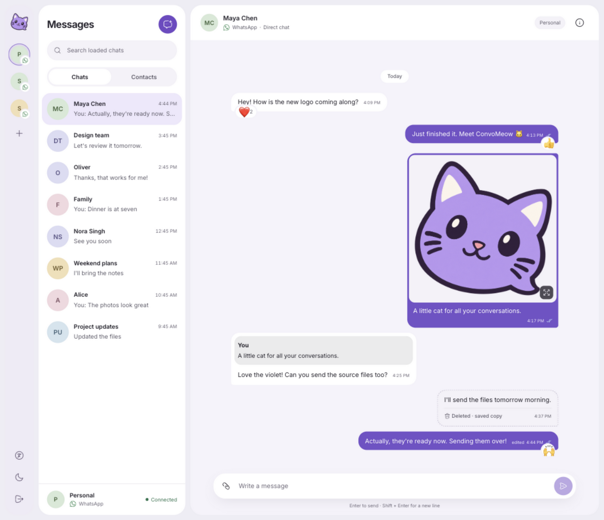

# ConvoMeow

A self-hosted client and API for WhatsApp, powered by [whatsmeow](https://github.com/tulir/whatsmeow). Manage multiple accounts through the web interface, CLI, or HTTP API.



*Preview with sample data.*

## Features

- Pair accounts by QR code and keep sessions across restarts.
- Browse conversations and synced contacts, including profile photos.
- Send text and files, reply to messages, and jump to quoted messages.
- View images and play audio in the web client.
- See delivery and read receipts as they arrive, with recipient details for groups.
- Receive live updates, including typing and recording indicators.
- Store media locally or in AWS S3, Cloudflare R2, and other S3-compatible storage.

WhatsApp is the current provider. The web client uses one access key for all accounts. History coverage depends on what WhatsApp supplies.

## Run locally

Install Go 1.27 or newer, Bun, and a C compiler for SQLite. Pairing requires a WhatsApp account on your phone.

```sh
git clone https://github.com/notborges/convomeow.git
cd convomeow

cd web
bun install --frozen-lockfile
bun run build
cd ..

go build -o convomeow ./cmd/convomeow
./convomeow --web-dir web/dist serve
```

Open [localhost:8787/app/](http://localhost:8787/app/) and sign in with the key from `data/control.token`. Add an account, then scan its QR code from **Linked devices** in WhatsApp on your phone.

The server stores sessions and messages in `./data`. Keep this directory private and back it up. For remote access, put the server behind HTTPS and restrict access. See [configuration and storage](docs/configuration.md) for server settings, access keys, and media storage.

### CLI

The CLI talks to the same running server. In another terminal:

```sh
./convomeow account list
./convomeow contact list personal
./convomeow chat list personal
./convomeow message send personal +15551234567 'Hello'
./convomeow message send-file --caption 'Photo' personal +15551234567 image ./photo.png
```

Replace `personal` with your account label or ID. To pair from the terminal, run `./convomeow account add personal`, then `./convomeow account login personal`.

To run the API and CLI without the web client, build the Go binary and start it with `./convomeow serve`. Bun is only needed for the web client.

## API and documentation

Use `/api/v1` with the access key as a bearer token. The web client and CLI both use this API; WebSocket carries change notifications.

- [API guide](docs/api/usage.md): authentication, messaging, media, replies, and receipts
- [OpenAPI reference](docs/api/openapi-v1.yaml): routes and request/response schemas
- [WebSocket protocol](docs/api/realtime.md): events and reconnect behavior
- [Configuration and storage](docs/configuration.md): local data, S3/R2, and limits

## Development

Run `make check` for the web build, formatting, dependency checks, Go build and vet, and tests with the race detector. Use `make fmt` to format Go and frontend files.

For frontend development, run the daemon on port 8787 and `bun run dev` in `web`. Vite proxies requests to the daemon. Frontend dependencies use `latest`; `web/bun.lock` records the installed versions. Run `bun update` to refresh them.

See [CONTRIBUTING.md](CONTRIBUTING.md) for contribution guidance. AI tools assist with code and documentation.

## License and affiliation

ConvoMeow uses the [Apache-2.0 license](LICENSE). Whatsmeow is a separate MPL-2.0 dependency.

ConvoMeow is an independent project, not affiliated with or endorsed by WhatsApp or Meta. It uses an unofficial WhatsApp client. Review [WhatsApp's terms](https://www.whatsapp.com/legal/terms-of-service) before using an account.
